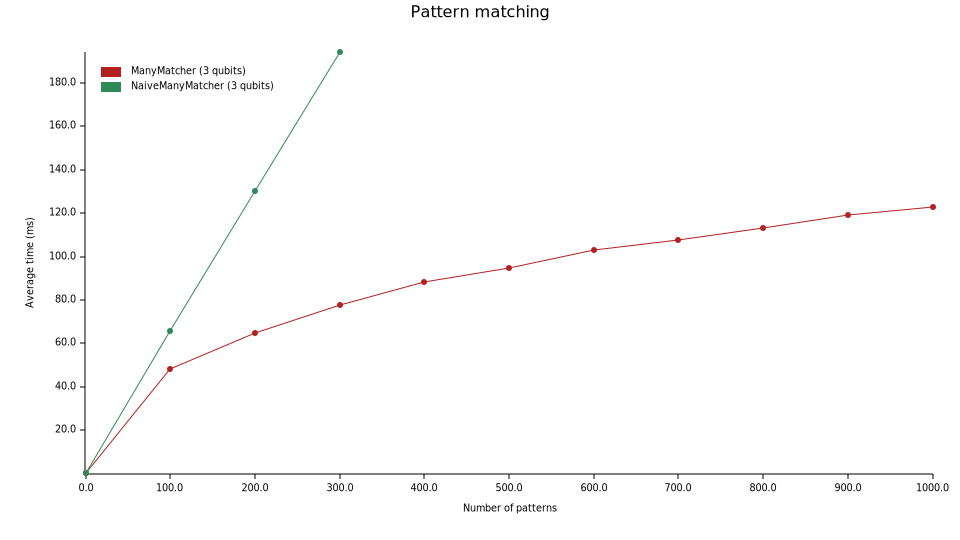
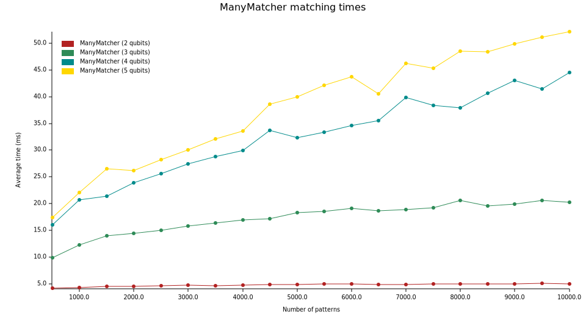
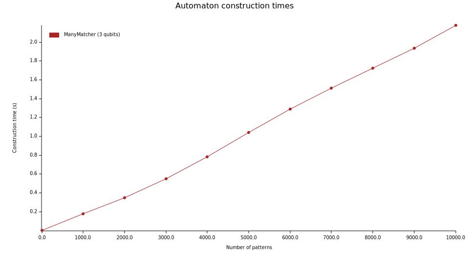

# portmatching

[![build_status][]](https://github.com/lmondada/portmatching/actions)
[![msrv][]](https://github.com/lmondada/portmatching)

Fast pattern matching on port graphs.

This crate is designed to find embeddings of port graphs fast, in the case
of many patterns. Patterns are preprocessed to make matching faster and
compiled into a graph trie data structure similar to the finite automata
used for string matching and regular expressions.

The crate exports several [`Matcher`](crate::Matcher) instances that can be used for pattern matching.
The principal object of interest in this crate is the [`ManyMatcher`](crate::ManyMatcher) object. 
The other [`Matcher`](crate::Matcher)s serve as baselines for benchmarking purposes.
[`SinglePatternMatcher`](crate::SinglePatternMatcher) matches a single pattern
in time `O(nm)` (size of the input times size of the pattern).
The [`NaiveManyMatcher`](crate::NaiveManyMatcher) uses `k` instances of
the [`SinglePatternMatcher`](crate::SinglePatternMatcher) to find matches
of any of `k` patterns in time `O(kmn)`.

## Benchmarks
For all benchmarks, inputs and patterns are random graphs with 
quantum circuit-like structure.
Inputs have up to 2000 nodes (gates) and 400 qubits,
patterns have up to 30 nodes and between 2 and 5 qubits.
For pattern matching on weighted graphs,
the weights for each node `n` are chosen at random
in the set `{(d, 0), (d, 1), (d, 2)}`, where `d` is the degree (arity) of
the node `n`.

Note: weighted pattern matching is much easier than unweighted, especially
as weights fix the arity of the nodes.
In a sense, unweighted pattern matching corresponds to the worst case.
Optimisations to the automaton could be made to significantly speed up
unweighted matching, but this has not been the focus.

#### Comparison to baseline [unweighted]
Pattern matching times for 0 ... 1000 patterns, `NaiveManyMatcher` vs automaton-based `ManyMatcher`.
The plot measures matching time (ms) as a function of the number of patterns.



#### Pattern matching scaling (on-line) [weighted]
Matching time (ms) as a function of the number of patterns for `ManyMatcher`
only, up to 10k patterns.
The patterns are categorised by the number of qubits.



#### Automaton construction time (off-line) [unweighted]
On top of the running time plotted above, there is also a one-time cost to
construct the automaton from the set of patterns.
This is plotted here, again as a function of the number of patterns.



## Example

```
use portgraph::{PortGraph, PortMut};
use portmatching::*;

let (mut g1, mut g2) = (PortGraph::new(), PortGraph::new());
g1.add_node(0, 0);
g2.add_node(1, 1);
let (p1, p2) = (UnweightedPattern::from_portgraph(&g1), UnweightedPattern::from_portgraph(&g2));
let trie = ManyMatcher::from_patterns(vec![p1, p2]);
trie.find_matches(&g1);
```

## Features

-   `serde`: Enable serialization and deserialization via serde.
-   `datagen`: Necessary for the [`data_generation`](src/bin/data_generation.rs) binary, for benchmarking. Currently not useful to the end user of
the crate.


## License

Distributed under the MIT License. See [LICENSE][] for more information.

  [build_status]: https://github.com/lmondada/portmatching/workflows/Continuous%20integration/badge.svg?branch=main
  [LICENSE]: LICENCE
  [msrv]: https://img.shields.io/badge/rust-1.70.0%2B-blue.svg?maxAge=3600
